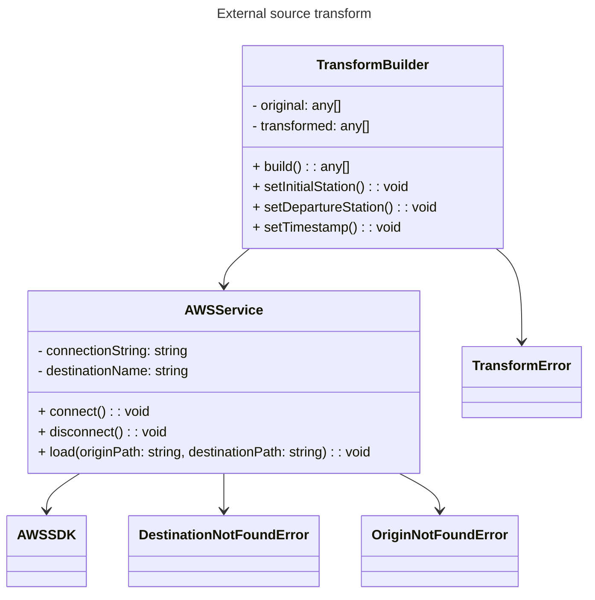

# Class Diagram

```mermaid
---
title: External source transform
---
classDiagram
    
    class TransformBuilder {
        - original: any[]
        - transformed: any[]
        + build(): any[]
        + setInitialStation(): void
        + setDepartureStation(): void
        + setTimestamp(): void
    }
    
    class AWSService {
        - connectionString: string
        - destinationName: string
        + connect(): void
        + disconnect(): void
        + load(originPath: string, destinationPath: string): void
    }
    
    class AWSSDK { }
    
    class DestinationNotFoundError { }
    
    class OriginNotFoundError { }
    
    class TransformError { }
    
    TransformBuilder --> AWSService
    AWSService --> AWSSDK
    AWSService --> DestinationNotFoundError
    AWSService --> OriginNotFoundError
    TransformBuilder --> TransformError
```